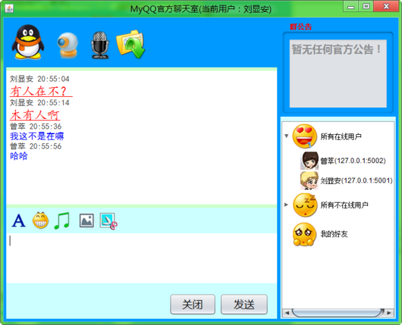
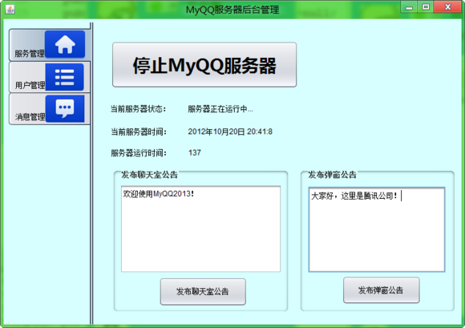

# 说明

Java版SWing“高”仿QQ即时通聊天系统

原贴地址：http://tieba.baidu.com/p/1933997044

首先说明这是一个很老很老的小项目，还是12年的时候写的，代码真的很low很low，low到什么级别呢？low到很多变量都是用中文命名的！这次之所以重新整理上传到GitHub，是因为12年的时候曾把这个发到网上，然后竟然还有很多人想要代码，当时是上传到CSDN还设置了积分，不方便下载。虽然没什么技术含量，但感觉对新人应该还是有一点借鉴的地方的。

用的是`Oracle`数据库（为方便安装，后来改为`MySQL`），`Swing`作界面。界面上高仿腾讯QQ的（特别是登录窗体,几乎与腾讯QQ2011没有区别 ），包括客户端和服务端，包含创建数据库的SQL命令，目前主要实现的功能包括私聊、表情发送、图片发送、文件传输、截图、群聊天室、系统公告、桌面弹窗、声音提醒、离线消息发送与接收等……

重要说明：

1. 不会继续更新和维护，因为过去很多年了；
2. 本身也有很多bug，仅限拿来玩玩；
3. 代码质量不代表真实水平，毕竟，还是学生时代的作品。

# 安装运行

环境要求：`jdk1.7` + `mysql`。

## 导入数据库

本地新建一个名为`myqq`的数据库，utf-8编码，导入`myqq.sql`即可，其实这里面很简单，就2个表。

## 导入Eclipse

项目是一个JavaSE项目，使用Eclipse3.7开发，按普通项目导入Eclipse即可。如果导入之后有关`sun.audio.AudioPlayer.player`部分报如下错误：

	Access restriction: The method start(InputStream) from the type AudioPlayer is not accessible due to restriction on required library D:\GreenSoft\Java\jre7\lib\rt.jar

可以先构建路径移除`JRE System Library`，然后再通过`Add Library`把`JRE System Library`添加回来即可。

## 修改配置

打开`com.MyTools.java`，修改服务器IP（本地测试时就是127.0.0.1）、服务器端口、数据库地址、数据库密码等。

## 启动

首先启动服务端：`server.frame.MainWindow.java`，记得要点击界面上的“启动MyQQ服务器”按钮，然后启动客户端：`client.control.Login.java`，要测试的话可以多启动几个客户端用不同账号测试。

内置的3个测试账号：小茗同学、马化腾、吴阳阳，密码都是`123`。当然也可以自己注册一个。

# 部分截图

主窗体：

发起聊天：

互相聊天：

表情发送：

简单的聊天室：

系统弹窗公告：

进入聊天室：

非常简陋的后台：

